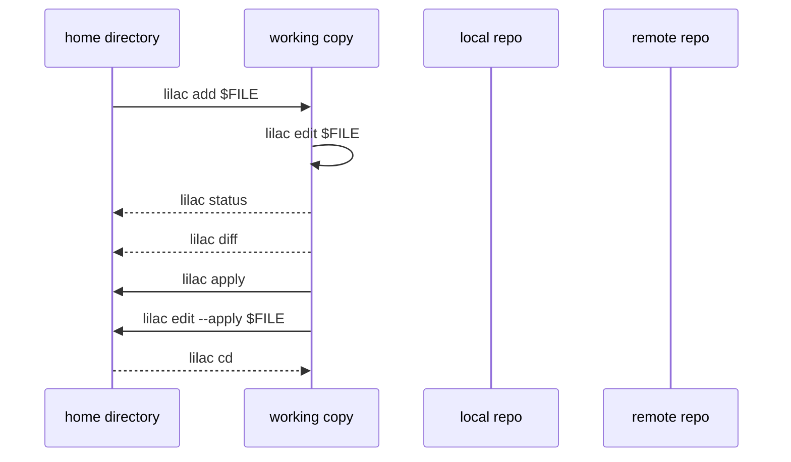
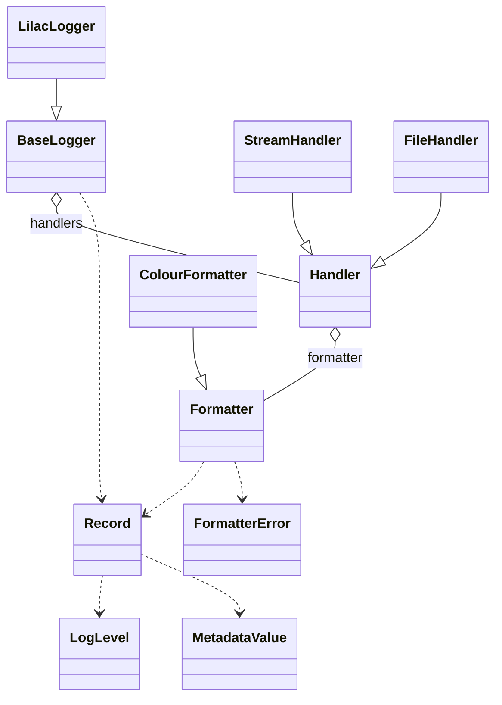
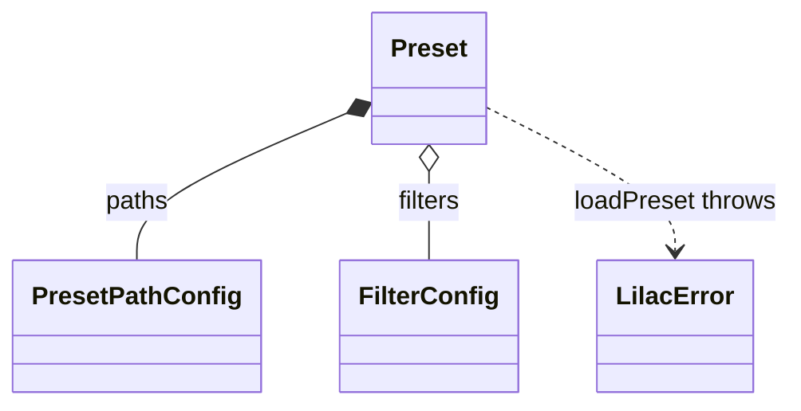
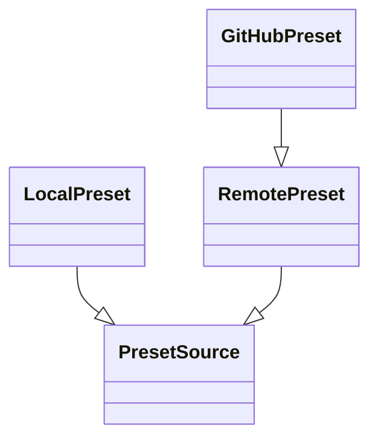
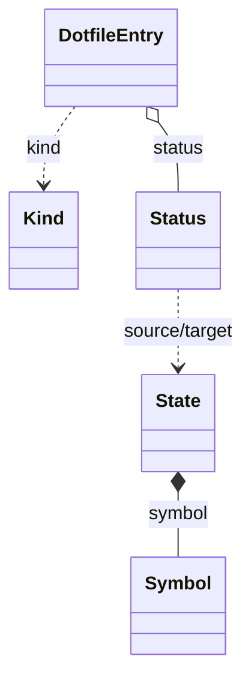

# LilacCore Diagrams

## Sequence Diagram

```mermaid
sequenceDiagram
    participant HD as home directory
    participant WC as working copy
    participant LR as local repo
    participant RR as remote repo

    HD->>WC: lilac add $FILE
    WC->>WC: lilac edit $FILE
    WC-->>HD: lilac status
    WC-->>HD: lilac diff
    WC->>HD: lilac apply
    WC->>HD: lilac edit --apply $FILE
    HD-->>WC: lilac cd
```

## Class Diagrams

### Logging

```mermaid
classDiagram
    class BaseLogger
    class LilacLogger
    LilacLogger --|> BaseLogger

    class Handler
    class StreamHandler
    class FileHandler
    StreamHandler --|> Handler
    FileHandler --|> Handler
    BaseLogger o-- Handler : handlers

    class Formatter
    class ColourFormatter
    ColourFormatter --|> Formatter
    Handler o-- Formatter : formatter

    class Record
    class LogLevel
    class MetadataValue
    class FormatterError

    BaseLogger ..> Record
    Formatter ..> Record
    Formatter ..> FormatterError
    Record ..> LogLevel
    Record ..> MetadataValue
```

### Preset

```mermaid
classDiagram
    class Preset
    class PresetPathConfig
    class FilterConfig
    class LilacError

    Preset *-- PresetPathConfig : paths
    Preset o-- FilterConfig : filters
    Preset ..> LilacError : loadPreset throws
```

---

```mermaid
classDiagram
    class PresetSource
    class LocalPreset
    class RemotePreset
    class GitHubPreset

    LocalPreset --|> PresetSource
    RemotePreset --|> PresetSource
    GitHubPreset --|> RemotePreset
```

### DotfileEntry

```mermaid
classDiagram
    class DotfileEntry
    class Kind
    class Status
    class State
    class Symbol

    DotfileEntry ..> Kind : kind
    DotfileEntry o-- Status : status
    Status ..> State : source/target
    State *-- Symbol : symbol
```
